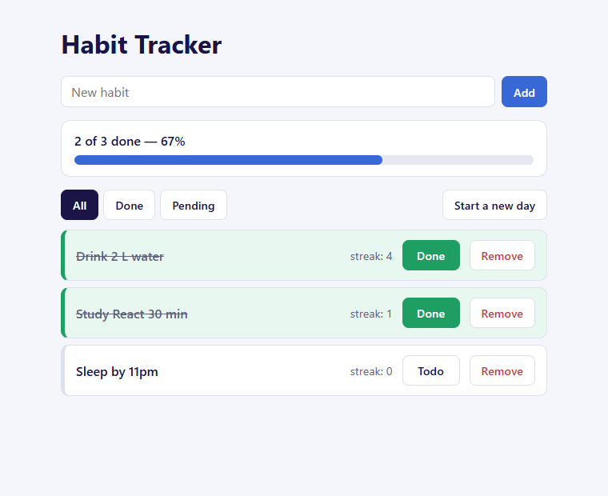

# Habit Tracker

A small React app for daily habits: add a habit, tick it off for today, watch its streak grow, and see a banner with how much of today is done. It uses only `useState` and event handlers. There is no backend, so refreshing the page brings back the three starting habits.



## Setup

```bash
npm install
npm run dev
```

Then open the address Vite prints (usually http://localhost:5173).

## Files

| File | What it does |
| --- | --- |
| `src/main.jsx` | Mounts `<App />` into the page (created by Vite). |
| `src/App.jsx` | Owns the `habits` array and every function that changes it (add, toggle, remove, undo, new day, filter). |
| `src/HabitForm.jsx` | A controlled input and an Add button. Blank titles are ignored, and Enter adds without reloading. |
| `src/HabitCard.jsx` | One habit: title, streak, Todo/Done toggle, Remove. It has no state of its own. |
| `src/SummaryBanner.jsx` | Works out done / total / % from `habits` on every render and shows a progress bar. |

## Predictions (written before building), then tested

### 1. Mutating in place: `h.streak++`, `h.doneToday = !h.doneToday`, `return [...prev]`

**Prediction:** Because the array is new, React re-renders. But in development, `<StrictMode>` calls the updater function **twice** with the same `prev`, and both calls change the same object. So the streak goes up twice, and `doneToday` flips twice, ending where it started.

**What actually happened:** After one click on *Sleep by 11pm* (streak 0), the card showed **`streak: 2`** and the button still said **`Todo`**. The banner stayed at *2 of 3 done*. A second click showed `streak: 4`, still `Todo`. There was nothing in the console. The bug is silent, and a production build would hide it (streak 1, Done). That's why you always return a **new object**: `{ ...h, streak: h.streak + 1 }`.

### 2. `id: habits.length`

**Prediction:** Remove the first habit (id 1) and two habits are left, so the new habit gets `id: 2`, the same id as *Study React 30 min*. Clicking Todo on the new habit toggles **both** of them, and React warns about duplicate keys.

**What actually happened:** Clicking **Todo** on the new habit turned it to `Done, streak 1`. At the same time, *Study React 30 min* flipped from `Done, streak 1` to `Todo, streak 0`. The console showed `Encountered two children with the same key` errors. That's why this app uses a counter that only goes up (`nextId++`) and never works the id out from the array.

### 3. Leaving out `e.preventDefault()`

**Prediction:** The browser submits the form the old-fashioned way and reloads the page, so all state is lost and the new habit never stays.

**What actually happened:** The URL changed to `http://localhost:5173/?`, the page reloaded, and the list went back to the three starting habits. *Meditate* was gone, and so were any other changes made before clicking Add.

## Stretch goals (all four done)

1. **Start a new day.** Every habit goes back to *not done*.
   **Streak rule:** a habit that **was done** today keeps its streak, so it carries on tomorrow. A habit that **was not done** today missed a day, so its streak **resets to 0**.
2. **Undo the last removal.** After *Remove*, an Undo bar appears. Undo puts the habit back **at the same index** it was removed from, not at the end. Only the last removal can be undone. Starting a new day clears the undo, so an old copy can't bring back yesterday's state.
3. **Filter: All / Done / Pending.** Only the chosen filter (`'all' | 'done' | 'pending'`) is stored. The visible list is calculated with `habits.filter(...)` on every render, and there is never a second array in state.
4. **Celebrate.** When every habit is done, the banner turns green and shows 🎉.
   *Remove every habit: is it still celebrating?* No. "0 of 0 done" would count as "all done" (`0 === 0`), but celebrating nothing makes no sense. So the rule is `total > 0 && done === total`, and with no habits the banner shows `0 of 0 done — 0%` with no celebration.

## Edge cases checked

- Removing every habit: the banner shows `0 of 0 done — 0%` and a "No habits yet" message appears.
- Un-marking a habit whose streak is already 0: the streak stays at 0 (`Math.max(0, streak - 1)`).
- A title that is only spaces: it is ignored (the title is trimmed first).
- Pressing Enter: the habit is added with no page reload.
- No errors or warnings in the browser console.
